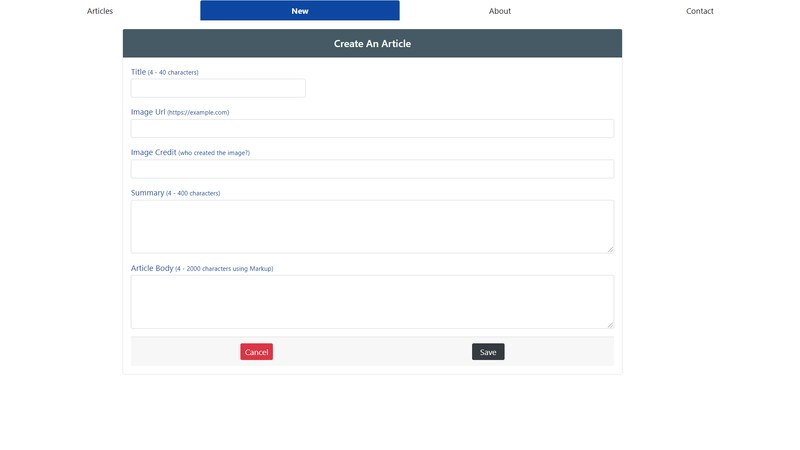

# :zap: MEEN Stack Articles

* Displays articles, written using markup language, on Bootstrap cards.
* It uses the MongoDB, Express, Ejs & Node.js (MEEN) stack to perform Create, Read, Update and Delete (CRUD) operations.
* **Note:** to open web links in a new window use: _ctrl+click on link_


## :page_facing_up: Table of contents

* [:zap: MEEN Stack Articles](#zap-meen-stack-articles)
	* [:page\_facing\_up: Table of contents](#page_facing_up-table-of-contents)
	* [:books: General info](#books-general-info)
	* [:camera: Screenshots](#camera-screenshots)
	* [:signal\_strength: Technologies](#signal_strength-technologies)
	* [:floppy\_disk: Setup](#floppy_disk-setup)
	* [:computer: Code Examples](#computer-code-examples)
	* [:cool: Features](#cool-features)
	* [:clipboard: Status \& To-Do List](#clipboard-status--to-do-list)
	* [:clap: Inspiration](#clap-inspiration)
	* [:file\_folder: License](#file_folder-license)
	* [:envelope: Contact](#envelope-contact)

## :books: General info

* The EJS (Express JS) template engine enables the use of static template files with dynamic content. It is faster and simpler than Angular or React but has less features.
* Partials were used to be able to reuse the same code, eg `header.ejs` - which includes the Bootstrap CDN link & `navbar.ejs` - a common top navigation bar.
* Index (home) page: Article images with summaries are displayed in a responsive grid so they wrap around nicely as the screen size changes. The number of articles is displayed at the top using the articles array length.
* Display_all Page: The header shows the creation date, formatted using the Javascript 'toLocaleDateString' method. The footer has buttons to redirect back to the home page and to the article edit page. There is also an article delete button with a user confirmation alert.
* Article Edit Page: User can change all article fields. Date will update automatically to todays date. Footer has edit cancel and save buttons. 2nd nav menu and credit for image
* New Article page: User can create a new article by filling in validated form fields.
* About page: Displays information about the app. Footer has links to the 4 MEEN full-stack technologies used.
* Contact page: Displays Github API data on app author with links to personal website and contact page.

## :camera: Screenshots




## :signal_strength: Technologies

* [EJS v3](https://ejs.co/#promo) Embedded Javascript templating to generate HTML markup
* [Express method-override v3](http://expressjs.com/en/resources/middleware/method-override.html) to be able to use HTTP verbs PUT or DELETE
* [Express v4](https://expressjs.com/) framework for Node.js
* [MongoDB Atlas](https://www.mongodb.com/docs/) free shared DB cluster used
* [Mongoose v6](https://mongoosejs.com/) object modelling for Node.js
* [marked v4](https://www.npmjs.com/package/marked) to convert markdown to html
* [Slugify v1](https://www.npmjs.com/package/slugify) to replace unwanted characters etc
* [Dompurify v3](https://www.npmjs.com/package/dompurify) used as an XSS sanitizer for the output HTML from the markdown text
* [Node-fetch v2](https://www.npmjs.com/package/node-fetch) light-weight npm module that adds a window.fetch compatible API to Node.js, used here to fetch my data from the Github API
* [Material Icons](https://material.io/resources/icons/?style=baseline) svg data used to create a `public/images` folder of icons I can reuse
* [Unsplash images](https://source.unsplash.com/) - random images used for building article card array. `https://source.unsplash.com/random/400x300` supplies a random image to the specified size 400x300
* [Day.js v1](https://day.js.org/en/) used with [relative time](https://day.js.org/docs/en/display/from-now#list-of-breakdown-range) plugin to calculate how long ago article was written.

## :floppy_disk: Setup

* Run `npm i` to install dependencies.
* Create a root-level `.env` file and add MongoDB connection string: `MONGO_URI="MongoDB connection string"`
* Run `npm run dev` to create an Ejs client and backend server concurrently.
* Navigate to `http://localhost:4000/` to see frontend (refresh after changes - does not auto-update).

## :computer: Code Examples

* extract from `controllers.js` to get length of articles array and convert this to a variable `totalArticles` to be used in `index.ejs` to show total number of articles. Variable `articlesString` also created in `controllers.js` and used in the HTML markup to show the word `article` or `articles`.

```javascript
// Display articles list in date order
exports.article_list = async (req, res) => {
	try {
		const articles = await Article.find().sort({ createdAt: 'desc' });
		const totalArticles = articles.length;
		const articlesString = articles.length === 1 ? ' article' : ' articles';
		res.render('articles/index', {
			articles,
			totalArticles,
			articlesString,
		});
	} catch (err) {
		res.status(500).json({ message: err.message });
	}
};
```

```html
		<div class="d-flex justify-content-center pt-3 pl-2">
			<div class="alert alert-success border-dark p-2 mb-1" role="alert">
				<p class="mb-0 text-center">
					You have
					<span class="badge badge-pill badge-light" style="font-size: 18px"
						><%= totalArticles%></span
					><%= articlesString %>
				</p>
			</div>
		</div>
```

## :cool: Features

* The backend code separates Express controller functions from routes: routes forward requests to the applicable controllers and controllers read/write data using models.
* Updating an article will automatically update the date so it goes to the front of the (date-sorted) notes list

## :clipboard: Status & To-Do List

* Status: Working. Refactor - add functionality.
* To-Do: Add articles for screen prints. Add modals/toasts to say if title is repeated etc. Add markdown editor?

## :clap: Inspiration

* [Web Dev Simplified: How To Build A Markdown Blog Using Node.js, Express, And MongoDB](https://www.youtube.com/watch?v=1NrHkjlWVhM)
* [Building a Simple CRUD app with Node, Express, and MongoDB](https://zellwk.com/blog/crud-express-mongodb/)
* [MDN Web DOcs: Express Tutorial Part 4: Routes and controllers](https://developer.mozilla.org/en-US/docs/Learn/Server-side/Express_Nodejs/routes)

## :file_folder: License

* This project is licensed under the terms of the MIT license.

## :envelope: Contact

* Repo created by [ABateman](https://github.com/AndrewJBateman), email: gomezbateman@yahoo.com
